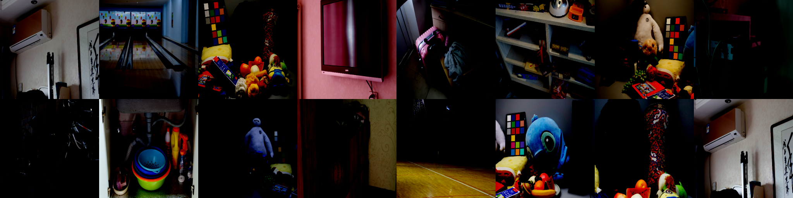
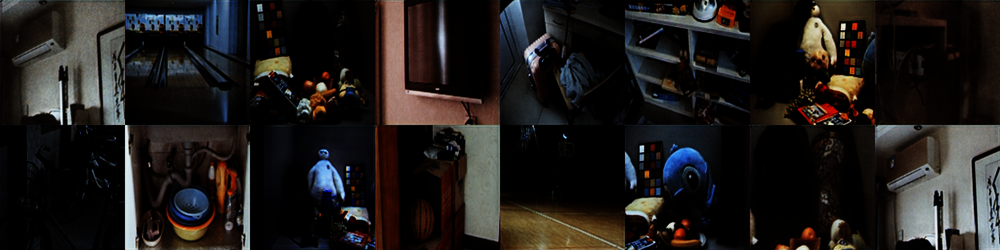

# 低光照图像增强 (基于扩散模型)

[](https://cloud.189.cn/web/share?code=AJ7fUzBbuUzm) (访问码: q2u9)
[](https://github.com/yourusername/INR2RGB)

这是一个基于 PyTorch 和 Diffusers 库的深度学习项目，**核心利用条件扩散模型 (Conditional Diffusion Model)** 进行低光照图像增强。项目旨在将低光照、噪声严重的图像恢复为清晰、正常的图像。

(可选) 本项目也包含了早期基于生成对抗网络 (GAN) 的实现 (`DeepTranserGAN.py`)，但当前推荐使用扩散模型方法。

## 项目特点

- **核心技术**: 基于 `diffusers` 库实现的条件扩散模型 (Conditional Denoising Diffusion Probabilistic Models - DDPM)。
- **条件生成**: 利用低光照图像作为条件，引导扩散过程生成对应的正常光照图像。
- **高质量恢复**: 旨在生成细节丰富、色彩自然的增强图像。
- **灵活配置**: 支持通过命令行参数调整模型结构、训练超参数和采样设置。
- **Accelerate 支持**: 使用 `accelerate` 库简化分布式训练和混合精度训练。
- **评估指标**: 训练过程中使用 PSNR 和 SSIM 评估模型性能。
- **图像与视频预测**: 支持对图像数据集和单个视频文件进行增强处理。
- **现代包管理**: 使用 `uv` 进行快速、可靠的依赖管理。

## 效果展示

*您可以在此处替换为扩散模型生成的效果图*

| 输入（低光照）                      | 输出（扩散模型增强后）               |
| :----------------------------------: | :---------------------------------: |
|      |      |
| *(示例图，请替换为实际效果)*        | *(示例图，请替换为实际效果)*        |

## 预训练模型

我们提供了基于 LOL 数据集训练的预训练 **扩散模型 UNet**：
- 模型下载: [](https://cloud.189.cn/web/share?code=AJ7fUzBbuUzm) (访问码: q2u9)
- 下载后解压，你会得到一个包含 `diffusion_pytorch_model.bin` 和 `config.json` 的目录。在预测时，将 `--model_path` 指向此目录。

## 环境要求

- Python 3.8+
- PyTorch 2.0+
- `diffusers`, `accelerate`, `transformers` 等库 (详见 `requirements.txt`)
- CUDA (强烈推荐用于加速训练和预测)
- `uv` (用于包管理，推荐)

## 安装步骤

1.  **克隆仓库:**
    ```bash
    git clone https://github.com/yourusername/INR2RGB.git # 请替换为你的仓库地址
    cd INR2RGB
    ```

2.  **安装 `uv` (如果尚未安装):**
    `uv` 是一个快速的 Python 包安装和解析器。
    ```bash
    # macOS / Linux
    curl -LsSf https://astral.sh/uv/install.sh | sh

    # Windows (需要 PowerShell)
    powershell -c "irm https://astral.sh/uv/install.ps1 | iex"

    # 其他安装方式见: https://github.com/astral-sh/uv#installation
    ```
    安装后请确保 `uv` 在你的 PATH 中，可能需要重启终端。

3.  **创建并激活虚拟环境 (推荐):**
    ```bash
    # 使用 uv 创建虚拟环境 (推荐)
    uv venv .venv
    source .venv/bin/activate  # Linux/macOS
    # .venv\Scripts\activate  # Windows

    # 或者使用 conda
    # conda create -n inr2rgb python=3.9
    # conda activate inr2rgb

    # 或者使用 venv
    # python -m venv .venv
    # source .venv/bin/activate # Linux/macOS
    # .venv\Scripts\activate    # Windows
    ```

4.  **使用 `uv` 安装依赖:**
    ```bash
    uv pip install -r requirements.txt
    ```
    如果遇到 CUDA 相关问题，请确保你的 PyTorch 版本与 CUDA 版本兼容，并可能需要根据 PyTorch 官网指示进行特定安装。

## 数据集准备

项目使用 LOL 数据集 (Low-Light paired dataset) 或类似的 **低光照 / 正常光照 配对** 数据集。

数据集结构应如下：
```
datasets/
└── <your_dataset_name>/  # 例如 kitti_LOL
    ├── train/             # 训练集目录 (或者像 LOL 数据集那样分散)
    │   ├── high/          # 正常光照图像
    │   └── low/           # 低光照图像
    └── test/              # 测试集目录 (或者像 LOL 数据集那样分散)
        ├── high/          # 正常光照图像
        └── low/           # 低光照图像

# LOL 数据集示例结构
datasets/
└── kitti_LOL/
    ├── eval15/            # 通常用作测试集
    │   ├── high/
    │   └── low/
    └── our485/            # 通常用作训练集
        ├── high/
        └── low/
```
**重要**: `LowLightDataset` 类 (`datasets/data_set.py`) 需要根据你的具体数据集结构和命名约定进行调整。当前的实现是基于 LOL 数据集的 `eval15` 和 `our485` 目录结构。

您可以从 [LOL数据集官网](https://daooshee.github.io/BMVC2018website/) 下载 LOL 数据集，或使用自己的数据集（确保调整 `LowLightDataset` 实现）。

## 使用方法

### 训练扩散模型

使用 `diffusion_trainer.py` 脚本进行训练。

1.  **配置训练参数:**
    可以直接修改 `diffusion_trainer.py` 中的 `parse_args()` 函数默认值，或通过命令行传递参数。

2.  **运行训练脚本:**
    推荐使用 `accelerate` 启动训练，以方便使用分布式训练和混合精度。

    **单 GPU 训练:**
    ```bash
    accelerate launch diffusion_trainer.py \
        --data_dir ../datasets/kitti_LOL \
        --output_dir diffusion_output_lol \
        --resolution 256 \
        --train_batch_size 4 \
        --num_train_epochs 300 \
        --gradient_accumulation_steps 1 \
        --learning_rate 1e-4 \
        --lr_scheduler cosine \
        --lr_warmup_steps 500 \
        --mixed_precision fp16 \
        --checkpointing_steps 5000 \
        --validation_epochs 10 \
        --seed 42
        # --enable_xformers_memory_efficient_attention # 如果安装了 xformers 可以启用
        # --resume_from_checkpoint latest # 从最新的检查点恢复
        # --lightweight_unet # 使用轻量级UNet进行快速测试
    ```

    **多 GPU 训练:**
    首先配置 `accelerate`:
    ```bash
    accelerate config
    ```
    按照提示配置你的多 GPU 环境（通常选择 "This machine" 并指定使用的 GPU 数量）。
    然后使用相同的命令启动：
    ```bash
    accelerate launch diffusion_trainer.py [其他参数同上...]
    ```

3.  **监控训练:**
    训练日志和 TensorBoard 文件会保存在 `--output_dir` 指定的目录下的 `logs` 子目录中。
    ```bash
    tensorboard --logdir diffusion_output_lol/logs
    ```
    模型检查点会保存在 `--output_dir` 下的 `checkpoint-<step>` 目录中。最终模型会保存在 `--output_dir/unet_final`。

### 使用扩散模型进行预测

使用 `diffusion_predictor.py` 脚本进行预测。

#### 图像数据集预测

```bash
python diffusion_predictor.py \
    --mode image \
    --model_path diffusion_output_lol/unet_final \
    --data_dir ../datasets/kitti_LOL/eval15 \
    --output_dir diffusion_image_predictions \
    --resolution 256 \
    --num_inference_steps 50 \
    --eval_batch_size 8 \
    --device cuda
```

#### 单个视频预测

```bash
python diffusion_predictor.py \
    --mode video \
    --model_path diffusion_output_lol/unet_final \
    --video_path /path/to/your/input_video.mp4 \
    --output_dir diffusion_video_prediction_output \
    --resolution 256 \
    --num_inference_steps 50 \
    --save_output_video \
    --save_frame_interval 100 \
    --device cuda
    # --display_video # 可选，实时显示处理结果
```

### 预测参数说明

- `--mode`: 预测模式 (`image` 或 `video`)。
- `--model_path`: **必需**，指向包含 `diffusion_pytorch_model.bin` 和 `config.json` 的 **已训练 UNet 模型目录** 的路径。
- `--output_dir`: 保存预测结果的根目录。
- `--device`: 使用设备 (`cuda` 或 `cpu`)。
- `--resolution`: 模型输入/输出分辨率 (应与训练时一致)。
- `--num_inference_steps`: 扩散采样步数。
- `--data_dir` (图像模式): 输入图像数据集的路径。
- `--eval_batch_size` (图像模式): 图像预测批次大小。
- `--video_path` (视频模式): 输入视频文件的路径。
- `--save_output_video` (视频模式): 是否保存增强后的视频。
- `--save_frame_interval` (视频模式): 每隔 N 帧保存一次 PNG 图像。
- `--display_video` (视频模式): 是否实时显示处理中的视频帧。

## 模型评估

训练过程中，`diffusion_trainer.py` 会定期在验证集（测试集）上运行采样，并计算 PSNR 和 SSIM 指标。这些指标以及生成的样本图像会记录到 TensorBoard 中。

## 项目结构

```
INR2RGB/
├── diffusion_trainer.py      # 扩散模型训练脚本
├── diffusion_predictor.py    # 扩散模型预测脚本
├── DeepTranserGAN.py         # (可选) 旧版 GAN 实现
├── models/                   # 模型定义 (包含旧版 GAN 模型)
│   ├── base_mode.py
│   ├── common.py
│   └── Repvit.py
├── datasets/                 # 数据集处理
│   └── data_set.py           # LowLightDataset 类定义
├── utils/                    # 工具函数 (部分可能只用于 GAN)
│   ├── loss.py
│   └── misic.py
├── requirements.txt          # Python 依赖列表
├── README.md                 # 项目说明 (中文)
├── README_en.md              # 项目说明 (英文)
└── examples/                 # 示例图片
    ├── real.png
    └── fake.png
```

## 常见问题

1.  **CUDA 内存不足 (OOM Error)**:
    *   在训练时 (`diffusion_trainer.py`):
        *   减小 `--train_batch_size`。
        *   增大 `--gradient_accumulation_steps`。
        *   确保已启用 `--mixed_precision fp16` (或 `bf16` 如果硬件支持)。
        *   尝试启用 `--gradient_checkpointing` (会稍慢但更省内存)。
        *   尝试启用 `--enable_xformers_memory_efficient_attention` (如果已安装 `xformers`)。
        *   降低 `--resolution`。
    *   在预测时 (`diffusion_predictor.py`):
        *   减小 `--eval_batch_size` (图像模式)。
        *   降低 `--resolution`。

2.  **训练不稳定或效果不佳**:
    *   调整学习率 `--learning_rate`。
    *   尝试不同的学习率调度器 `--lr_scheduler` 和预热步数 `--lr_warmup_steps`。
    *   调整 UNet 模型结构参数 (通道数、块类型等，需要修改代码或添加更多命令行参数)。
    *   确保数据集质量和配对准确性。
    *   增加训练轮数 `--num_train_epochs`。

3.  **`LowLightDataset` 报错**:
    *   请仔细检查你的数据集目录结构是否与 `datasets/data_set.py` 中 `LowLightDataset` 类的预期匹配。
    *   根据你的实际数据集结构修改 `LowLightDataset` 中的文件路径查找逻辑。

4.  **`uv` 安装或使用问题**:
    *   查阅 `uv` 官方文档: [https://github.com/astral-sh/uv](https://github.com/astral-sh/uv)
    *   确保 `uv` 已正确添加到系统 PATH。

## 引用

如果你在研究中使用了本项目，请考虑引用 `diffusers` 库和相关的扩散模型论文。可以添加如下引用：

```bibtex
@misc{von-platen-diffusers-2022,
  author = {Patrick von Platen and Suraj Patil and Anton Lozhkov and Pedro Cuenca and Nathan Lambert and Kashif Rasul and Mishig Davaadorj and Thomas Wolf},
  title = {Diffusers: State-of-the-Art Diffusion Models},
  year = {2022},
  publisher = {GitHub},
  journal = {GitHub repository},
  howpublished = {\\url{https://github.com/huggingface/diffusers}}
}
@misc{ho2020denoising,
      title={Denoising Diffusion Probabilistic Models},
      author={Jonathan Ho and Ajay Jain and Pieter Abbeel},
      year={2020},
      eprint={2006.11239},
      archivePrefix={arXiv},
      primaryClass={cs.LG}
}
# 如果你修改或扩展了本项目，也可以添加你自己的引用信息
@misc{INR2RGB_Diffusion_2024,
  author = {你的名字或团队}, # 例如: 黄小海
  title = {基于扩散模型的低光照图像增强},
  year = {2024}, # 或实际年份
  publisher = {GitHub},
  howpublished = {\\url{https://github.com/yourusername/INR2RGB}} # 替换为你的仓库地址
}
```

## 许可证

[MIT License](LICENSE) (如果你的项目使用 MIT 许可证)

## 联系方式

如有任何问题，请通过以下方式联系：

- 邮箱: huangxiaohai99@126.com
- GitHub Issues: [https://github.com/huangxiaohaiaichiyu/INR2RGB/issues](https://github.com/huangxiaohaiaichiyu/INR2RGB/issues) (替换为你的仓库地址)
